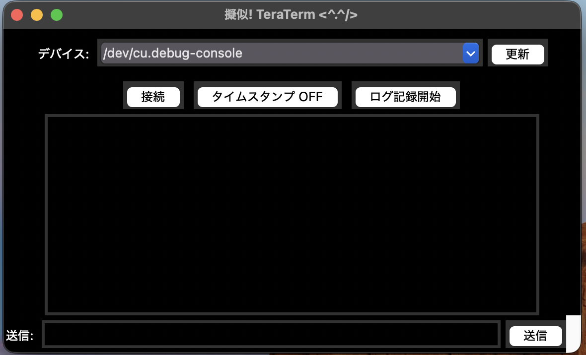

# SerialMoniter_S-W
## 📌 Overview

**Pseudo! TeraTerm** is a lightweight serial communication tool built with Python + Tkinter for **macOS**.  
Since TeraTerm is not available on macOS, this tool acts as a simple, clean alternative.

It provides:

- Easy connection to USB serial devices (`/dev/tty.usbmodemXXXX`)
- Automatic detection of Arm boards (displayed as `- Arm`)
- Black terminal with white text for high visibility  
- Optional timestamp insertion  
- Log saving to a file  
- Automatic installation of `pyserial` when missing  

The app runs standalone with no external GUI frameworks.

---

## ✨ Features

| Feature | Description |
|--------|-------------|
| **Automatic USB device detection** | Detects `/dev/tty.usbmodemXXXX` and labels Arm boards as `- Arm` |
| **Black background & white text console** | Comfortable and high-contrast serial monitor |
| **Timestamp toggle (ON/OFF)** | Prepends log lines with time (e.g. `[12:34:56]`) |
| **Log recording** | Save console output to any file (`.log`, etc.) |
| **Send input box** | Send text commands to microcontrollers |
| **Auto pip installation** | Installs `pyserial` automatically at startup |

---

## 📦 Installation

### 1. Install Python3  
(macOS often includes it)

```sh
python3 --version
